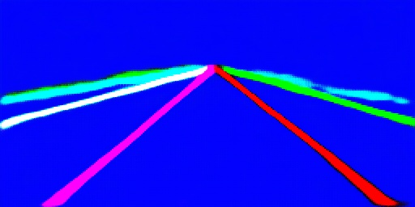

# Lanenet-Lane-Detection (pytorch version)
  
[中文版](https://github.com/IrohXu/lanenet-lane-detection-pytorch/blob/main/CHINESE_README.md)  

## Introduction   
Use pytorch to implement a Deep Neural Network for real time lane detection mainly based on the IEEE IV conference paper "Towards End-to-End Lane Detection: an Instance Segmentation Approach".You can refer to their paper for details https://arxiv.org/abs/1802.05591. This model consists of ENet encoder, ENet decoder for binary semantic segmentation and ENet decoder for instance semantic segmentation using discriminative loss function.  

The main network architecture is:  


## Generate Tusimple training set/validation set/test tet   
First, download tusimple dataset [here](https://github.com/TuSimple/tusimple-benchmark/issues/3).  
Then, run the following command to generate the training/ val/ test samples and the train.txt/ val.txt/ test.txt file.   
Generate training set:  
```
python tusimple_transform.py --src_dir path/to/your/unzipped/file --val False
```
Generate training/ val set:  
```
python tusimple_transform.py --src_dir path/to/your/unzipped/file --val True
```
Generate training/ val/ test set:  
```
python tusimple_transform.py --src_dir path/to/your/unzipped/file --val True --test True
```
path/to/your/unzipped/file should like this:  
```
|--dataset
|----clips
|----label_data_0313.json
|----label_data_0531.json
|----label_data_0601.json
|----test_label.json
```  

## Training the model    
The environment for training and evaluation:  
```
python=3.6
torch>=1.2
numpy=1.7
torchvision>=0.4.0
matplotlib
opencv-python
pandas
```
Using example folder:   
```
python train.py --dataset ./data/training_data_example
```
Using tusimple folder:   
```
python train.py --dataset path/to/tusimpledataset/training
```

## Testing result    
A pretrained trained model by myself is located in ./log (only trained in 25 epochs)      
Test the model:    
```
python test.py --img ./data/tusimple_test_image/0.jpg
```
The testing result is here:    
    
    
    


## Discussion:  
The architecture of LaneNet is based on ENet, which is a very light model. That is why I can upload it to github. However, ENet is not the best model to detect lane and do instance segmentation. I will try to add other framework into this program like deeplabv3+ later.

## Plan and future work:  

- [x] Add H-Net.
- [x] Use new encoder-decoder structure.
- ~~[ ] Discriminative loss for instance segmentation~~
- ~~[ ] U-Net Encoder and U-Net decoder~~
- ~~[ ] E-Net Encoder and E-Net decoder~~

Future work will release soon.   

## Reference:  
The lanenet project refers to the following research and projects:  
Neven, Davy, et al. "Towards end-to-end lane detection: an instance segmentation approach." 2018 IEEE intelligent vehicles symposium (IV). IEEE, 2018.   
```
@inproceedings{neven2018towards,
  title={Towards end-to-end lane detection: an instance segmentation approach},
  author={Neven, Davy and De Brabandere, Bert and Georgoulis, Stamatios and Proesmans, Marc and Van Gool, Luc},
  booktitle={2018 IEEE intelligent vehicles symposium (IV)},
  pages={286--291},
  year={2018},
  organization={IEEE}
}
```  
Paszke, Adam, et al. "Enet: A deep neural network architecture for real-time semantic segmentation." arXiv preprint arXiv:1606.02147 (2016).   
```
@article{paszke2016enet,
  title={Enet: A deep neural network architecture for real-time semantic segmentation},
  author={Paszke, Adam and Chaurasia, Abhishek and Kim, Sangpil and Culurciello, Eugenio},
  journal={arXiv preprint arXiv:1606.02147},
  year={2016}
}
```  
De Brabandere, Bert, Davy Neven, and Luc Van Gool. "Semantic instance segmentation with a discriminative loss function." arXiv preprint arXiv:1708.02551 (2017).   
```
@article{de2017semantic,
  title={Semantic instance segmentation with a discriminative loss function},
  author={De Brabandere, Bert and Neven, Davy and Van Gool, Luc},
  journal={arXiv preprint arXiv:1708.02551},
  year={2017}
}
```  


https://github.com/MaybeShewill-CV/lanenet-lane-detection    
https://github.com/klintan/pytorch-lanenet    


